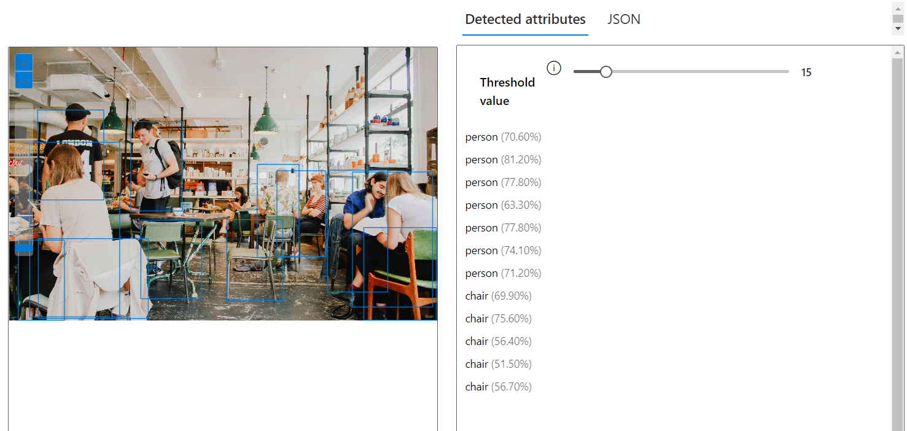
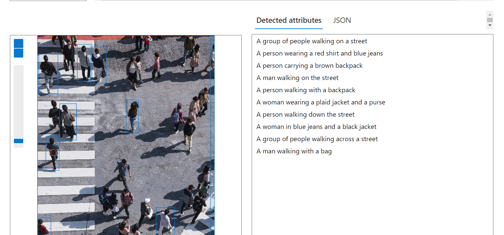

# Laboratório 02 

Este repositório diz respeito ao Laboratório n. 02 da ... cujo objetivo é explorar os recursos de Reconhecimento Facial e transformação de imagens em Dados no Azure ML.

# Serviços testados

Os serviços estão disponíveis e foram acessados no endereço https://portal.vision.cognitive.azure.com/ do "Vision Studio" e foram testados utilizando os créditos oferecidos pela própria Azure para experimentação.

1. **Extract Text From Images**

Used image `test_extract_text_from_shakespeare_poem.jpg` to extract its text information.

The result is saved into `output` directory.

2. **Add captions to images**

This service generate a human-readable sentence that describes the content of an image.

I'd tested with `test_recognize_objects.jpg`. This image is obtained on Unsplash.

The service descibres image as: "A group of people sitting at tables in a restaurant"

For the imagem `test_ai_image_services.jpg` the caption was: "A group of people walking on a street".

3. **Spatial Services**

Some spatial services is not open for test with our assets.

I was curios about services that "Count people in an area" and "Detect when people enter/exit a zone".

4. **Detect common objects in images**

For this service, I used `test_recognize_objects.jpg` and it could detect: 6 persons (1 missed!) and 5 chairs. 



I also tried with `grocery-shop.jpg` and `product-shelves.jpg` with no results. 

The similiar service ("Recognize anda analyze shelf products") could not be easy tested with own images.

5. **Add dense captions to images**

It differs from service n. 3 mentioned. The caption is fully detailed.

For example, for image `test_ai_image_services.jpg` the caption was:

```
A group of people walking on a street
A person wearing a red shirt and blue jeans
A person carrying a brown backpack
A man walking on the street
A person walking with a backpack
A woman wearing a plaid jacket and a purse
A person walking down the street
A woman in blue jeans and a black jacket
A group of people walking across a street
A man walking with a bag
```

